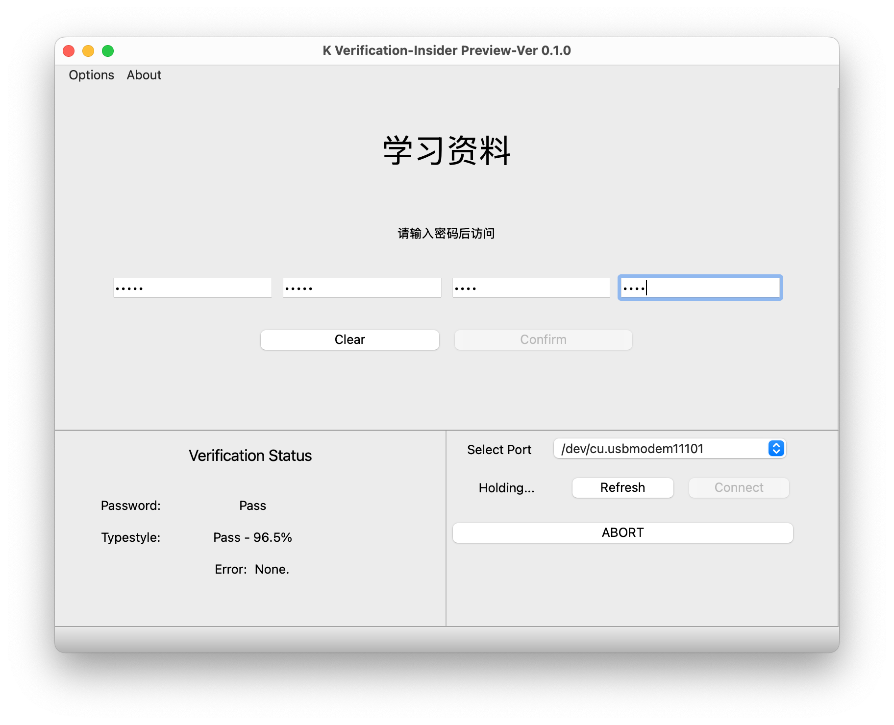

# Screenshots


# How to use

## 1 Install environment
```bash
pip install -r requirements.txt
```

## 2 Load the Private Key to your arduino Board
You can generate your own RSA key pairs by simply running `generateKeys.py` .

This step can be ignored since there are default ones.

## 3 Load the arduino programs to your board
This step requres Arduino IDE.

NOTE: The Arduino programs are just for test, there are no AI functions inside.

If you want the full Arduino Program including AI features, please use the `Arduino_final` zip file instead.

## 4 Makefiles
Run `make all` to generate UI file and open main window.

Run `make run` to simply launch the main window using local cached UI files.

Run `make ui1` to only update the UI file.

# Acknowledgements
the RSA functions are modified from this Library:

[nikkotorcita/RSA_arduino_library](https://github.com/nikkotorcita/RSA_arduino_library)